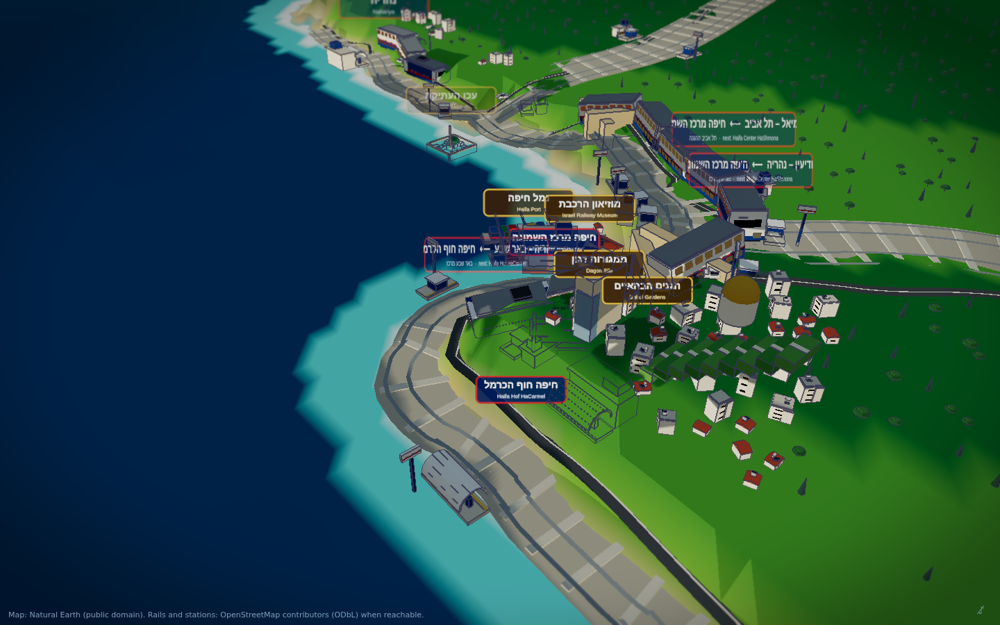
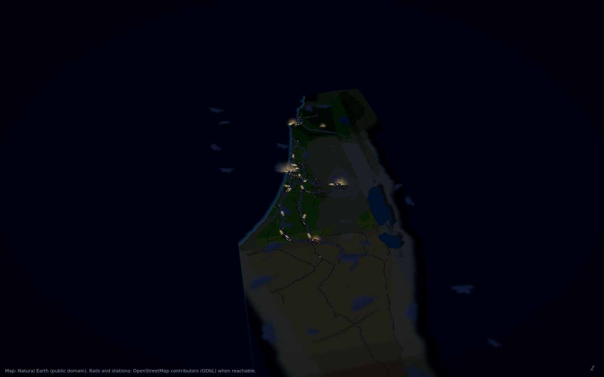

# ישראל ברכבת · Israel by Rail

A stylised 3D Israel seen from the air, carrying the real railway network,
with Israel Railways trains, a heritage steam train and freight running on it.
The sun is where it really is: the page opens at Israel's current time.

Everything you see is generated in code. There are no downloaded models,
textures, fonts or sounds. The one thing that is not invented is the map:
coastline, lakes, rails, stations, roads and cities come from real data, and
the rails and stations are fetched live from OpenStreetMap when the page opens.





## Running it

```
npm install
npm run dev          # http://localhost:5173
```

| command | what it does |
| --- | --- |
| `npm run build` | production build into `dist/` |
| `SINGLE=1 npm run build` | one self-contained `dist-single/index.html` |
| `npm run data` | rebuild `data/world.json` and `data/network.json` from Natural Earth |
| `npm run fetch:osm` | bake a snapshot of the OpenStreetMap network into the bundled data |
| `npm run check` | clearance and integrity check on the bundled network, see below |
| `npm run test:live` | the same check plus the desk test on a network loaded through the live path |
| `npm run shots` | headless screenshots and console capture from a running preview |
| `npm run test:controls` | click and drag every desk control in headless Chromium |

`check`, `test:live`, `shots` and `test:controls` need `npm run preview` running
in another window. Each accepts a page URL as its first argument.

## Using it

Drag to orbit, wheel to zoom, right-drag to pan. Click a station to see its
name in Hebrew and English and fly closer. Gold plates mark landmarks.

The desk at the bottom of the screen:

- **מהירות · SPEED** lever: how fast the trains run
- **שעה · TIME** lever: the hour, from midnight to midnight
- **תאורה · LIGHTS**: window and street lights on, whatever the hour
- **שמש אמיתית · REAL SUN**: follow Israel's clock (the TIME lever follows too)
- **סובב קטרים · TURNTABLE**: turns the turntable at the railway museum in Haifa East
- **תנועה · TRAFFIC**: road traffic on or off
- **צפירה · WHISTLE**: the nearest train sounds its horn (steam whistle for the heritage train)

Keys: `↑`/`↓` speed, `←`/`→` time, `1` to `5` the buttons, `Q` render quality, `R` home view.

## The live network

When the page opens it shows the bundled map at once, then asks the
[Overpass API](https://overpass-api.de/) (OpenStreetMap's query service) for
every railway line and every station inside Israel's bounding box. Three public
mirrors are tried in turn. The answer is turned into a graph in the browser
(`src/network-build.js`, the same code the build script uses), the routes are
recomputed by shortest path, and the rails, stations, trains and the buildings
around them are rebuilt in place. The line at the bottom right of the screen
says which network you are looking at and when it was fetched.

- The result is kept in the browser (IndexedDB) for seven days, so the fetch
  happens about once a week. A stale copy is still used if OpenStreetMap is
  unreachable that day.
- If the API is down, blocked or answers with too little (fewer than four
  routes or twenty stations), the bundled map stays and the status line says so.
- Light rail and subway lines, sidings and preserved lines are left out.
  Station names come from OpenStreetMap's `name:he` and `name:en` tags.

URL switches: `?refresh` ignores the cache and fetches again; `?osm=off` never
contacts OpenStreetMap; `?osm=fixture` loads a snapshot from
`fixtures/overpass-israel.json` (what `npm run test:live` uses);
`?osm=https://…` reads a saved Overpass answer from any URL.

The first fetch downloads a few megabytes and can take ten to forty seconds on a
busy mirror. The desk and the bundled map work meanwhile.

Map data (c) OpenStreetMap contributors, ODbL.

## Where the bundled map comes from

- **Natural Earth 1:10m** (public domain): coastline, the Kinneret and the Dead
  Sea, the Jordan, country outlines, cities, roads and railways.
  `scripts/fetch-natural-earth.mjs` clips them to Israel and rasterises the land
  and lake masks; the result is `data/world.json` (89 KB).
- **Stations**: `data/stations.json`, 68 Israel Railways stations with Hebrew and
  English names. Their coordinates were entered by hand and are approximate;
  the live network replaces them with OpenStreetMap positions.
- **The network**: `scripts/build-network.mjs` joins the Natural Earth rail
  segments into a graph. Lines opened after that data was drawn (Karmiel, the
  Valley line, the airport and Modi'in, the fast line to Jerusalem, Bat Yam,
  Sderot to Beersheba) are generated from their station sequence and joined at
  their real junctions; they are flagged as approximate. Thirteen routes are
  computed by shortest path: `data/network.json`.
- **A better bundle**: `npm run fetch:osm` on a PC with internet access saves
  the current OpenStreetMap network to `data/osm-rail.json` and rebuilds
  `data/network.json` from it, so even the fallback map is current.

## How it is built

- **Terrain**: a 0.75 km heightfield sculpted from Israel's named relief
  (there is no elevation API reachable from the build environment), cut by the
  real land and lake masks, coloured by biome, exaggerated 3x. The neighbours
  are shown for context and sink into the sea beyond 32 km from the border.
- **Sea and lakes**: one sheet at sea level over ocean cells, shaded by depth;
  the Kinneret at -210 m and the Dead Sea at -430 m.
- **Sun**: the true solar position for Israel's clock (`Asia/Jerusalem`).
- **Rails**: every graph edge drawn once, draped on the terrain with a smoothed
  profile; tunnel portals and piers appear where the profile leaves the ground.
- **Trains**: one `InstancedMesh` per vehicle type; two-pivot placement keeps
  long cars on the curve; trains brake for stations and turn round at the ends.
- **Cities, trees, landmarks**: instanced blocks and trees placed through a
  spatial hash seeded with rails, roads and water; landmarks built from
  primitives at their real coordinates.
- **Look**: one shadow-casting sun whose frustum follows the camera, ambient
  occlusion, bloom, a tilt-shift blur and a vignette.

## Nothing may clip

`npm run check` runs two sets of rules. On the data: every station sits on a
line, every route is connected end to end and lies on Israel's land. In the
live scene (headless Chromium): every train car sits on its route's railhead;
no building, tree or landmark stands on a rail or a road; nothing is placed in
the water; every station has its plate. `npm run test:live` runs the same
rules on a network that went through the OpenStreetMap loader. Both run in CI
before every deploy.

## Licence

MIT. Map data: Natural Earth (public domain) and OpenStreetMap contributors (ODbL).
