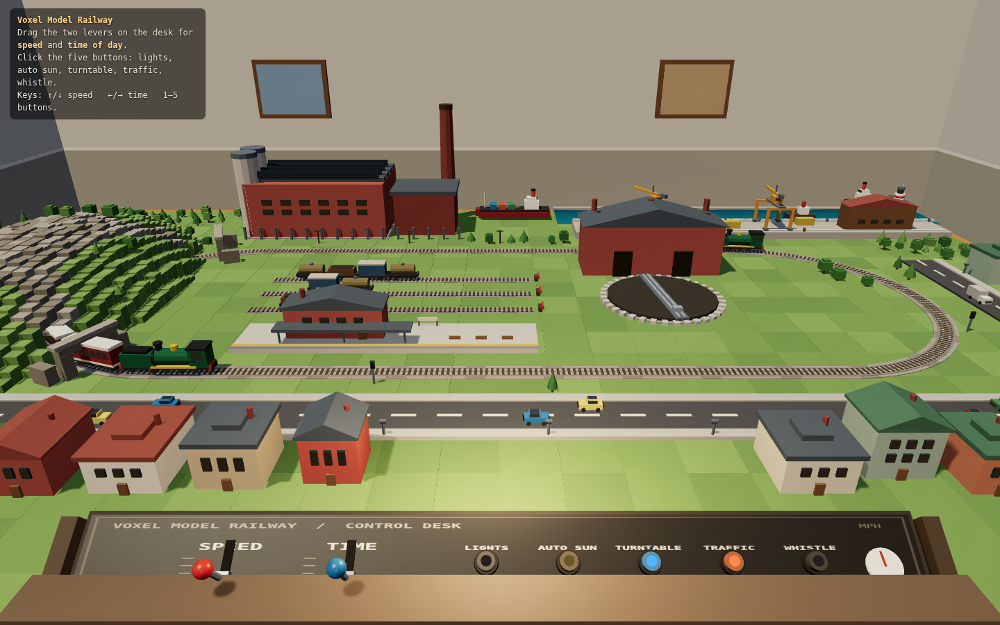
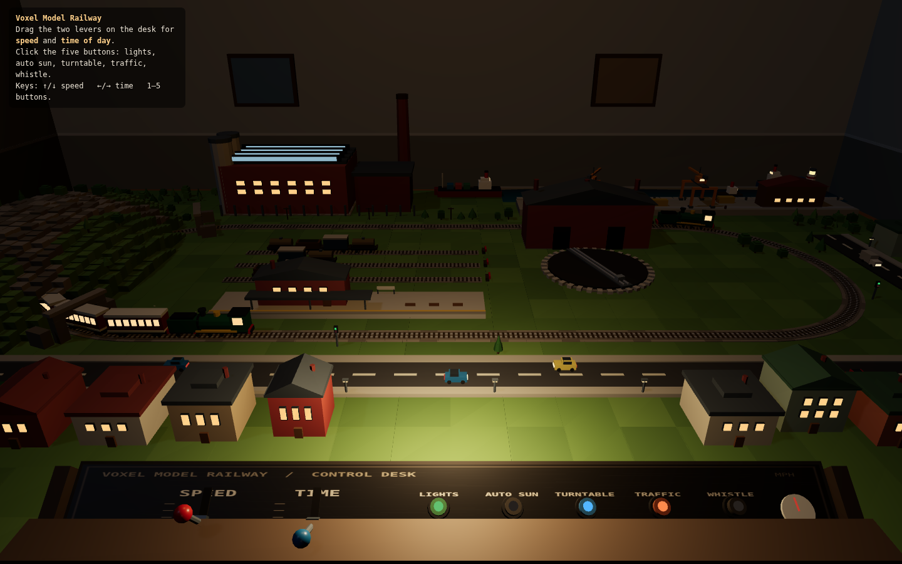
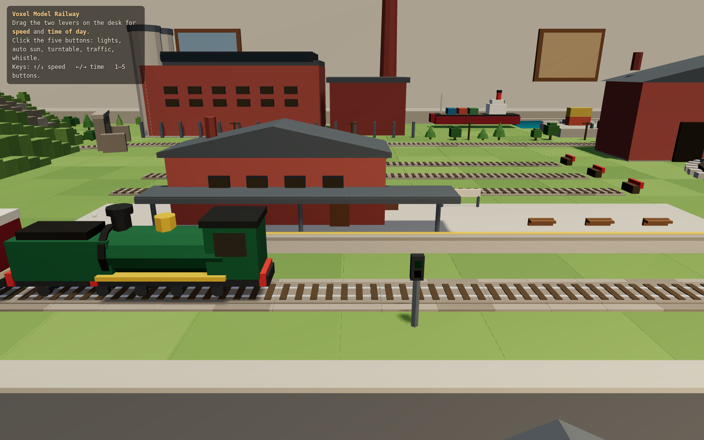

# Voxel Model Railway

A voxel HO-scale model railway, built as a diorama: the layout sits on a wooden
table in a room, and you look at it from standing eye height at the front edge,
with a control desk under your hands.

Everything is generated in code. There are no textures, models, sounds or any
other external assets: the buildings, stock, water, the panel lettering and even
the whistle are produced at runtime.







## Running it

```
npm install
npm run dev        # http://localhost:5173
```

Other scripts:

| command | what it does |
| --- | --- |
| `npm run build` | production build into `dist/` |
| `SINGLE=1 npm run build` | one self-contained `dist-single/index.html` |
| `npm run check` | automated clearance check (see below) |
| `npm run shots` | headless screenshots + console capture from a running preview |
| `npm run test:controls` | clicks and drags every desk control in headless Chromium |

## The controls

Two levers on the desk, dragged with the mouse:

- **SPEED** — how fast the trains run
- **TIME** — time of day, from midnight to midnight

Five latching buttons, each with a lit indicator when it is on:

- **LIGHTS** — turns the room and window lights on regardless of the hour
- **AUTO SUN** — runs the day/night cycle on its own; the TIME lever follows it
- **TURNTABLE** — rotates the turntable deck
- **TRAFFIC** — starts and stops the road vehicles
- **WHISTLE** — sounds the loco whistle (synthesised, momentary)

Keyboard equivalents: <kbd>↑</kbd>/<kbd>↓</kbd> speed, <kbd>←</kbd>/<kbd>→</kbd>
time, <kbd>1</kbd>–<kbd>5</kbd> for the buttons.

## What's on the layout

A continuous main line loop with a station and platform inside it, a three-road
yard with buffer stops and parked wagons, a working turntable and an engine
shed, a factory with a saw-tooth roof and a chimney, a harbour with a quay, two
gantry cranes on rails, containers, shipping and a lighthouse, a hill with a
bored tunnel, a town along two roads with moving traffic, and lineside signals,
telegraph poles and trees.

Two trains run in opposite directions: a passenger train (loco, tender and three
coaches) and a freight (loco, tender and four wagons).

## Layout of the source

```
src/
  layout.js       every coordinate on the baseboard, in one place
  palette.js      the colour palette
  voxel.js        box/cylinder builder that merges into one BufferGeometry
  occupancy.js    footprint registry used by the clearance check
  scene.js        renderer, camera, lights and the sun
  room.js         the room the table stands in
  table.js        the table and baseboard
  track.js        path maths, ballast, sleepers and rails
  scenery.js      hill, station, yard, factory, harbour, town, roads, trees
  rollingstock.js locos, coaches, wagons, ships, cranes, road vehicles
  water.js        the harbour water
  controls.js     the control desk, its panel texture and pointer handling
  animate.js      the frame loop, train/ship/traffic motion and smoke
  main.js         wires it all together
```

## Nothing may clip

`npm run check` builds the layout with a no-op geometry sink, collects the
footprint every object registered while it was placed, and asserts eight rules:

1. nothing inside the main line's ballast and loading gauge
2. nothing inside a yard siding's clearance
3. no building, prop, tree or wagon intersecting another
4. nothing standing on a road carriageway
5. no parked wagon hanging off the end of a siding
6. nothing off the baseboard or fouling the control desk
7. gantry crane legs on the quay rails, never on the running line or in the water
8. wheel treads resting exactly on the railhead

It runs in CI before every deploy, so a change that makes two things intersect
fails the build rather than shipping.

`npm run test:controls` is the companion check for the desk: against a running
preview it works out where each control is on screen, clicks the five button
caps and drags both levers with real pointer events, and asserts that the state
flipped, the indicator changed and the lever physically moved.

## Performance

Static geometry is merged into a small number of `BufferGeometry` objects with
baked vertex colours, so the room, the layout, the desk and the emissive window
panes are a handful of draw calls rather than thousands of meshes. The whole
scene draws in roughly 45 calls and 58k triangles.

There is one shadow-casting light. Its orthographic frustum hugs the table
rather than the room, which keeps a single 2048² map dense; the room is excluded
from shadow casting and receiving entirely. Smoke is a recycled `InstancedMesh`,
and the water ripple runs at 30 Hz rather than every frame.

## Licence

MIT.
